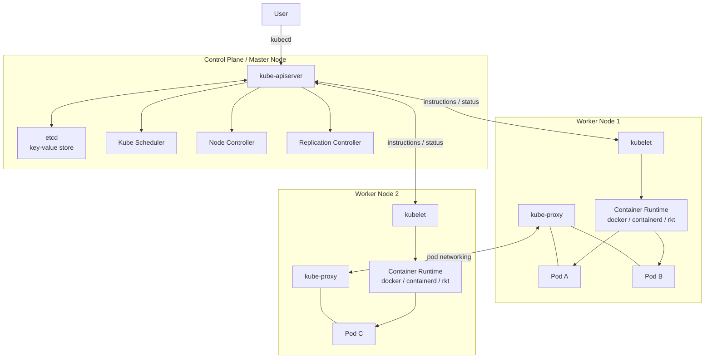

```mermaid
graph TD
    User -->|kubectl| API

    subgraph Control Plane / Master Node
        API[kube-apiserver]
        ETCD[etcd\nkey-value store]
        SCHED[Kube Scheduler]
        NC[Node Controller]
        RC[Replication Controller]

        API <--> ETCD
        API --> SCHED
        API --> NC
        API --> RC
    end

    subgraph Worker Node 1
        KL1[kubelet]
        KP1[kube-proxy]
        CRE1[Container Runtime\ndocker / containerd / rkt]
        POD1A[Pod A]
        POD1B[Pod B]

        KL1 --> CRE1
        CRE1 --> POD1A
        CRE1 --> POD1B
        KP1 --- POD1A
        KP1 --- POD1B
    end

    subgraph Worker Node 2
        KL2[kubelet]
        KP2[kube-proxy]
        CRE2[Container Runtime\ndocker / containerd / rkt]
        POD2A[Pod C]

        KL2 --> CRE2
        CRE2 --> POD2A
        KP2 --- POD2A
    end

    API <-->|instructions / status| KL1
    API <-->|instructions / status| KL2
    KP1 <-->|pod networking| KP2
```